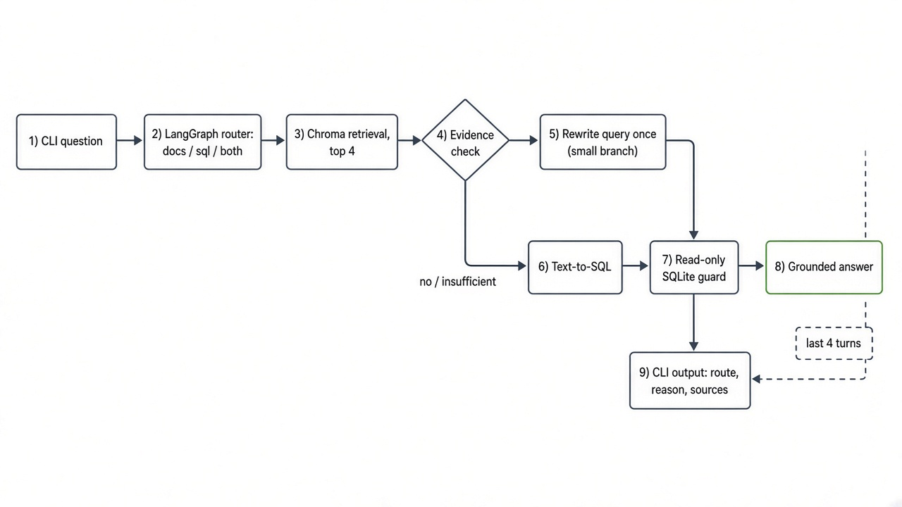

# Meridian Conversational AI Agent

Multi-source conversational agent combining company policy documents and structured SQLite data using LangGraph, ChromaDB, sentence-transformers, and NVIDIA Nemotron.



## Challenge

The assessment asked for a local conversational agent that answers natural-language questions from two sources: 15 company policy documents and a SQLite database of employees, departments, and projects. The agent must decide whether a question belongs in the documents, the database, or both, then return a single grounded answer.

Routing has to be explicit in the code. When the retrieved evidence is insufficient, the agent must say so rather than invent an answer. The stack is constrained to Python, LangGraph, ChromaDB, sqlite3, and sentence-transformers, with retrieval implemented directly (no LlamaIndex and no LangChain pre-built RAG chains). Live generation uses NVIDIA NIM: `nvidia/nemotron-3.5-lightning-30b-a3b` at `https://integrate.api.nvidia.com/v1`.

## How it works

```
User question
  → LangGraph router (docs / sql / both)
  → document retrieval and/or Text-to-SQL
  → evidence check
  → grounded answer (or a deterministic refusal)
```

The CLI prints the route, the routing reason, the answer, and the sources.

### Documents

- 15 policy/process files in `corpus/`
- Heading-based chunking (114 sections)
- Local embeddings: `sentence-transformers/all-MiniLM-L6-v2`
- Persistent Chroma collection, cosine distance
- Each hit keeps `source` (filename) and `section` metadata
- Top-4 retrieval; cosine distance is never used as proof that an answer exists

### Database

- Schema and seed data from the provided `setup_database.py`
- Nemotron writes one JSON SQL object from the live schema
- Generated SQL is treated as untrusted input and run only through `run_select()`
- Connection is read-only (`mode=ro`) with `PRAGMA query_only = ON`
- A SQLite authorizer allows SELECT/READ only
- One statement, `SELECT` or `WITH` prefix, at most 30 rows
- A progress handler stops queries after 2 seconds

### Orchestration

- LangGraph routes to `docs`, `sql`, or `both`; the reason is stored and printed
- Document excerpts are judged for the policy part of the question before answering
- Unsupported document questions retry once (query rewrite), then refuse in Python if still unsupported
- Empty or failed SQL results are reported as such; they are never turned into invented rows
- Session memory is the last four turns in the CLI process

## Engineering considerations

- `NVIDIA_API_KEY` is read only from the environment and is never stored
- Retrieved documents and SQL rows are wrapped as evidence, not as instructions
- Cosine similarity is not used as an answerability threshold
- If document evidence remains unsupported after the retry, the agent returns a fixed insufficient-information sentence without asking the answer model to invent one
- CLI errors print and the loop continues

## NVIDIA API access

The assessment specifies the NVIDIA hosted NIM endpoint with `nvidia/nemotron-3.5-lightning-30b-a3b`.

During the assessment, NVIDIA Build displayed: **“API Access Unavailable — Please contact support to verify your account.”** As a result, I was unable to generate a valid personal API key and therefore could not execute the NVIDIA-hosted end-to-end inference flow before submission.

The application remains configured for the required NVIDIA endpoint and model. Once a valid key is available, no architecture change is required — set `NVIDIA_API_KEY` and run the agent.

```bash
export NVIDIA_API_KEY="your_key_here"
python agent.py
```

- Endpoint: `https://integrate.api.nvidia.com/v1`
- Model: `nvidia/nemotron-3.5-lightning-30b-a3b`

Hosted generation has not been executed against an authenticated NVIDIA NIM session.

## Verification

Latest run of `python evaluation/run_evaluation.py` without `NVIDIA_API_KEY`:

**Local deterministic / offline verification**

| Check | Result |
|---|---|
| Corpus files | 15 / 15 |
| Indexed chunks | 114 / 114 |
| Source + section metadata | 114 / 114 |
| LangGraph compiles | PASS |
| Dataset facts vs corpus/DB | 22 / 22 |
| Retrieval Recall@4 | 6 / 6 (100%) |
| Retrieval Top-1 | 6 / 6 (100%) |
| SQL safety | 13 / 13 |
| Database row counts unchanged | PASS |
| Offline E2E (stubbed LLM boundary) | 10 / 10 |

Offline E2E (stubbed LLM boundary) exercises the real LangGraph, retrieval, and SQLite with a scripted stand-in only at the NVIDIA chat call. It is not a Nemotron execution.

**NVIDIA hosted live E2E — not executed** because API access was unavailable (no usable key).

## Project structure

```
.
├── agent.py
├── ingest.py
├── setup_database.py
├── requirements.txt
├── README.md
├── AI_PROMPT_LOG.md
├── DEMO.md
├── corpus/
│   └── 15 policy .txt files
├── evaluation/
│   ├── dataset.json
│   └── run_evaluation.py
└── docs/
    ├── meridian_agent_flow.png
    ├── architecture.excalidraw
    └── project_overview.md
```

`chroma_db/` and `meridian.db` are created locally by `ingest.py` and `setup_database.py`; they are not committed.

## Setup

Tested with Python 3.14.

```bash
python3 -m venv .venv
source .venv/bin/activate
pip install -r requirements.txt
```

Create the SQLite database:

```bash
python setup_database.py
```

Build the vector index (downloads MiniLM once, then runs locally):

```bash
python ingest.py
```

Configure NVIDIA and run:

```bash
export NVIDIA_API_KEY="your_key_here"
python agent.py
```

Type `exit` to quit. A single question can also be passed as an argument:

```bash
python agent.py "Who leads Project Vega?"
```

## Evaluation

```bash
python evaluation/run_evaluation.py
```

Without a key, the runner reports local/deterministic checks and the stubbed graph walkthrough, and skips NVIDIA hosted live E2E. With a valid `NVIDIA_API_KEY`, the same dataset is run through the real `ask()` path.

## Example questions

These cover documents, SQL, both sources, and an unsupported-information case. Answers are not included here because hosted Nemotron generation was not run.

- What is the minimum password length?
- Who leads Project Vega and where are they located?
- Which active employees in Data & AI work remotely?
- What is Aisha Patel's role, what standard laptop does the hardware policy give that role, and how much is the remote work setup allowance?
- Does Meridian provide pet insurance?

Representative prompts used during development are in [`AI_PROMPT_LOG.md`](AI_PROMPT_LOG.md).
