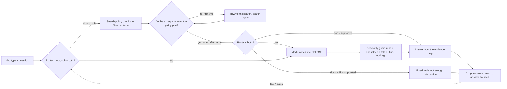

# How the Meridian assistant works

You ask a question in the terminal. The assistant decides whether the answer is in the company policy documents, the employee database, or both, collects the evidence, and replies with one answer and its sources. If the evidence does not contain the answer, it says so instead of guessing.

The full diagram is in `architecture.excalidraw`. To view it, open [excalidraw.com](https://excalidraw.com) and choose **Menu → Open**. A simpler version that GitHub renders:

## What happens when you ask a question

1. **Routing.** The model returns a JSON object with three fields:
   - `route`: `docs`, `sql`, or `both`
   - `reason`: one short sentence
   - `doc_query`: a standalone search query for the policy part of the question

   Python checks that the route is one of the three. If the reply is broken, it falls back to `both`, so neither source is skipped. A LangGraph conditional edge picks the next step from the route, so the decision is visible in the code. The CLI also prints it.
2. **Documents.** For `docs` and `both`, `doc_query` is embedded with a small local model and compared against the 114 policy sections. The four closest sections come back with their file name and heading. `doc_query` resolves follow-ups, so "And in other UK cities?" after a London hotel question is searched as a hotel-limit question.
3. **Checking the documents.** The model answers `{"supported": true | false}`: do these excerpts actually state what the policy part of the question asks? For a mixed question, only the policy part is checked; the database part is the SQL step's job. If the answer is no, the search is rewritten once, run again, and checked again.
4. **Database.** For `sql` and `both`, the model returns `{"sql": "..."}` built from the real schema. A guard runs it read-only. If the query fails or returns no rows, the model gets one chance to correct it.
5. **Answer.** The model returns three fields:
   - `supported`: true or false
   - `answer`: the reply text
   - `documents_used`: which excerpts the answer relies on

   It may only use the evidence it was given.
6. **Sources.** Python builds the source list from the retrieved sections and the tables named in the SQL. The model never writes source names.

## When the assistant refuses, enforced in code

Vector search always returns something, even for a question the documents never mention. We measured this: **Does Meridian provide pet insurance?** matched the Benefits document at distance 0.5075, which is closer than the correct password section at 0.5279. So distance is never used to decide whether an answer exists.

Instead, these cases are decided in Python, and the answer model is never asked:

| Situation | Reply |
|---|---|
| Documents question; excerpts still do not answer it after the retry | *The available company information does not contain enough information to answer the question.* |
| Database question; the query found nothing, even after the retry | *No matching record was found in meridian.db.* |
| Database question; the query failed | *The database query could not be completed…* |
| Mixed question; neither source produced evidence | the insufficient-information sentence |

When one source of a mixed question has evidence and the other does not, the answer covers the supported part and says what is missing. If the answer model itself reports `supported: false`, the reply is replaced with the fixed sentence and no sources are shown.

## Treating evidence as data, not instructions

Retrieved text and database rows are wrapped in `<RETRIEVED_DOCUMENTS>` and `<DATABASE_RESULTS>` tags. The prompts say this content is reference data only and that instructions inside it must never be followed. The conversation history is wrapped in `<CONVERSATION_HISTORY>` and is used only to understand follow-up questions, not as evidence.

## Database safety

The provided `setup_database.py` creates `meridian.db`. The assistant never trusts SQL written by the model. Every query goes through `run_select()`, which applies several layers:

- the file is opened read-only (`mode=ro`) and `PRAGMA query_only = ON` is set
- only one statement is allowed, and it must start with `SELECT` or `WITH`
- a SQLite authorizer allows only reading tables and calling functions; any write, schema change, `ATTACH`, or `PRAGMA` is refused by SQLite itself, even inside a `WITH`
- a progress handler stops any query that runs longer than 2 seconds
- at most 30 rows are returned
- failures come back as an explicit error, never as rows

An earlier version also blocked queries containing words like "update". That wrongly rejected harmless queries such as `name LIKE '%update%'`, so the authorizer replaced it.

## The NVIDIA client

- **Model and endpoint:** `nvidia/nemotron-3.5-lightning-30b-a3b` at `https://integrate.api.nvidia.com/v1`, through the OpenAI SDK. The key comes from `NVIDIA_API_KEY` and is never stored.
- **Settings:** temperature 0, JSON mode, and thinking disabled.
- **Limits:** a 40-second timeout and at most 2 automatic retries, handled by the SDK.
- **Compatibility:** if NVIDIA rejects JSON mode or the thinking option with HTTP 400 or 422, the request is sent once more without them, and the reply is parsed as JSON.
- **Errors:** authentication failures are raised, never hidden. The CLI prints the error and keeps running.

## Bonus features

- **Self-correction.** A document search that does not answer the question is rewritten and checked once more. A SQL query that fails or finds nothing is rewritten once.
- **Session memory.** While the CLI is open, the last four questions and answers go to the router and the SQL writer, and to the answer step to clarify follow-ups. After "Who leads Project Vega?", the question "Where is he located?" is resolved to James Okafor.

## The prompts inside the agent

All prompts are in `agent.py`. Each one asks for JSON, and Python validates every field.

| Prompt | Returns | What it asks |
|---|---|---|
| `ROUTER_SYSTEM` | `route`, `reason`, `doc_query` | Pick the source and write a standalone policy search query |
| `JUDGE_SYSTEM` | `supported` | Do the excerpts directly state the policy facts? Related topics are not enough |
| `REWRITE_SYSTEM` | `query` | A different search query for the second attempt |
| `SQL_SYSTEM` | `sql` | One read-only query from the schema, names instead of IDs |
| `ANSWER_SYSTEM` | `supported`, `answer`, `documents_used` | Answer only from evidence; say what is missing |

## Timing

Each step records its duration with `time.perf_counter()`: routing, retrieval, checking, retry, SQL, answer, and the total. The CLI shows the total. The evaluation reports average latency, overall and per route.

## Files

| File | Purpose |
|---|---|
| `ingest.py` | One-time: split the corpus, embed it, store it in Chroma |
| `agent.py` | Search, the SQL guard, the NVIDIA client, the LangGraph, and the CLI |
| `evaluation/dataset.json` | Questions with the expected route, facts, sources, and refusals, plus SQL safety cases |
| `evaluation/run_evaluation.py` | Runs the local checks and, with a key, the live checks |
| `setup_database.py`, `corpus/` | Provided by the assessment, unchanged |
| `AI_PROMPT_LOG.md` | Required prompt log of the key coding-agent prompts |
| `DEMO.md` | Honest note on the missing live NVIDIA transcript |
| `docs/` | Extra explanation and the flow diagram |

## How it is checked

`python evaluation/run_evaluation.py` has two parts.

**Local**, no key needed:

- **Index:** 15 documents, 114 chunks, and complete metadata.
- **Graph:** the LangGraph compiles with all six steps.
- **Dataset:** every expected fact is confirmed against the real database or policy file, and the unsupported topics are confirmed absent from the corpus.
- **Retrieval:** Recall@4 and top-1 accuracy over 6 targets.
- **SQL safety:** 13 cases.
  - Allowed: valid reads, the 30-row cap, and a harmless "update" inside a string.
  - Refused: writes, `DELETE` hidden behind `WITH`, `ATTACH`, `PRAGMA`, `load_extension`, and two statements in one query.
  - Stopped: a runaway query.
  - Afterwards, every table's row count must be unchanged.
- **Offline end-to-end, stubbed LLM:** the real graph, retrieval, and SQLite run with scripted model replies. This covers:
  - the docs, sql, and both routes
  - the document retry
  - the SQL retry after a refused `DELETE`
  - the router fallback
  - the pet-insurance refusal, where the answer model must not be called
  - the no-match reply
  - the memory follow-up

  This proves the wiring, not the NVIDIA model.

**Live**, with `NVIDIA_API_KEY`: every dataset case and both memory conversations run through the real model. The report shows routing accuracy, grounded facts, source attribution, unsupported handling, the overall pass rate, and latency. Facts are matched loosely, so `£1,500` matches `1500`, and a failing case never stops the run.

## Current status

- Verified locally: everything in the local section above. The latest result was all passing.
- Not yet run against NVIDIA: the live section. The account was waiting on NVIDIA's verification before an API key could be created.

Known limitations:

- The support check and the answer both rely on the model's judgement; the code enforces what happens when either says no.
- Anyone using the CLI can query every column, including salaries; access control was out of scope.
